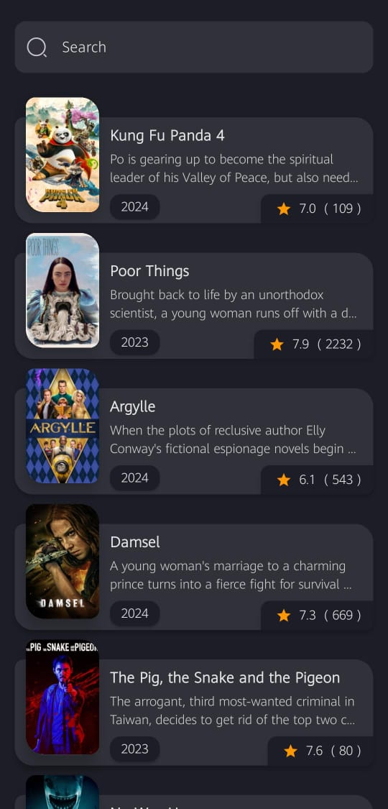
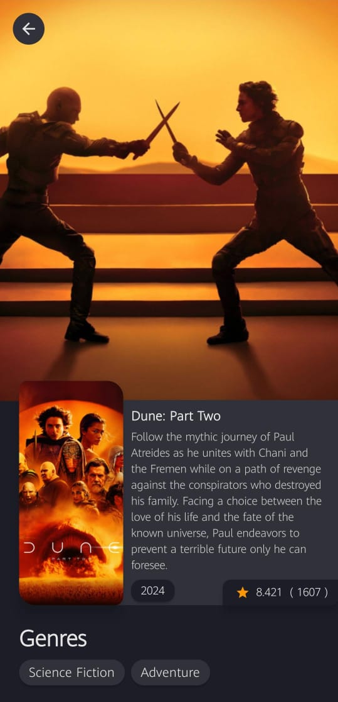

# Movies App

This is a Simple Movies App . The app allows users to browse through a collection of movies, view
details about each movie, and search for specific movies. It utilizes modern Android development
technologies and follows best practices to provide a seamless user experience.

## Screenshots

*Description of the first screenshot.*

*Description of the second screenshot.*

## Technologies Used

- **Kotlin**: The app is built entirely with Kotlin, leveraging its modern language features and
  concise syntax for Android development.
- **Jetpack Compose**: Used for building the UI of the app. Provides a modern and declarative way to
  create user interfaces.
- **MVI Architecture**: The app follows the Model-View-Intent (MVI) architecture pattern for a clear
  separation of concerns and better maintainability.
- **Compose Navigation**: Utilized for navigation between different screens in the app,
  seamlessly integrated with Jetpack Compose.
- **Hilt**: Utilized for dependency injection in the app.
- **Android Architecture Components**: Including AppCompat, Navigation Compose, and Material
  components for UI consistency and navigation.
- **Retrofit & OkHttp Interceptor**: Handles network requests and authorization. OkHttp Interceptor
  is used for logging network activities and for authorization purposes. The app depends on the
  Movies APIs from [The Movie Database (TMDb)](https://www.themoviedb.org/documentation/api) for
  fetching movie data.
- **Kotlin Coroutines**: Facilitates asynchronous programming for improved app responsiveness.
- **Kotlinx Serialization JSON**: Enables efficient serialization and deserialization of JSON data.
- **Arrow**: Utilized for functional programming constructs in Kotlin, enhancing code readability
  and maintainability.

## Features

- **Browse Movies**: Users can browse through a list of movies.
- **Movie Details**: View detailed information about each movie.
- **Search**: Search for specific movies.
